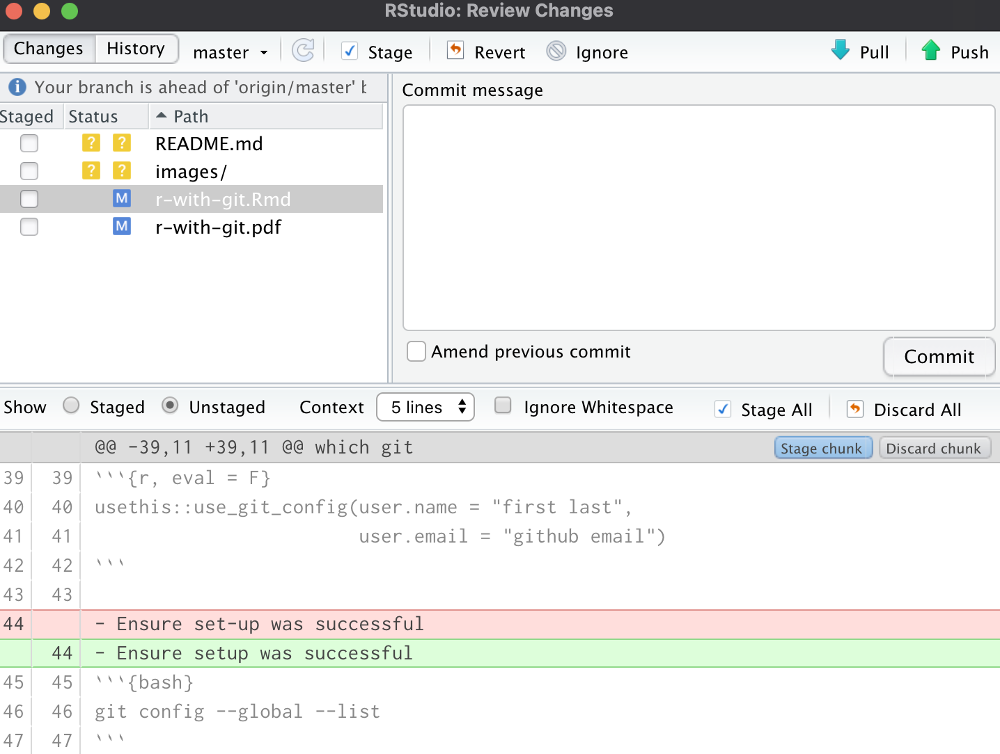
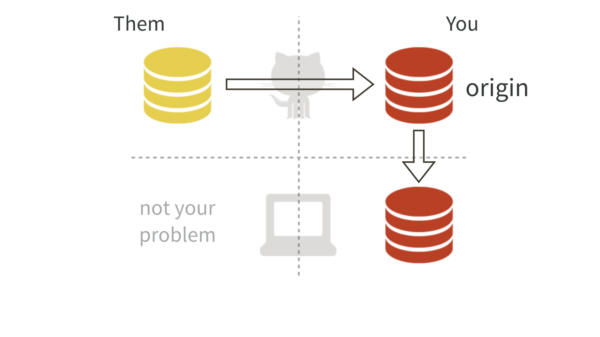

```{r setup, include=FALSE}
knitr::opts_chunk$set(
  ollapse = TRUE,
  comment = "#>",
  eval = FALSE)
```

# Setup

## Install Git

Git allows us to track changes to our documents (i.e. Git is version control).

-  Check if git is already installed: `which git`
```{bash, echo = F}
which git 
```

- Install git for Windows: <https://gitforwindows.org/>
- Install git for Mac: `brew install git`
- Install git for Linux:
  + Ubuntu or Debian: `sudo apt-get install git`
  + Fedora or RedHat: `sudo yum install git`
  
## Configure Git

- Introduce yourself to git
```{r}
usethis::use_git_config(user.name = "first last",
                        user.email = "github email")
```

- Ensure setup was successful
```{bash}
git config --global --list 
```

## Managing Git(Hub) Credentials[^ref]

- Adopt HTTPS
- [Secure your account with 2FA](https://docs.github.com/en/github/authenticating-to-github/securing-your-account-with-two-factor-authentication-2fa)
- Create a PAT: `usethis::create_github_token()`
- Store PAT into the Git credential store: `gitcreds::gitcreds_set()`

[^ref]: Following the [usethis guide](https://usethis.r-lib.org/articles/articles/git-credentials.html)

# Git Basics

## Stage & Commit

- We can create and edit files within our project
- We can then **stage** and **commit** these changes

```{r, eval = T, echo = F, out.width='75%', fig.align='center', fig.cap='Git Workflow'}
knitr::include_graphics('images/git-workflow.png')
```

## Diff

- We can look at the set of *differences* between files to see what has changed

```{r, eval = T, echo = F, out.width='60%', fig.align='center', fig.cap='Example Diff'}

```

## Commit Best Practices

Each commit should be:

- *Minimal:* A commit should only contain changes related to a single problem 
    or feature
- *Complete:* A commit should add the functionality it claims to add
- *Concise, yet evocative:* At a glance, you should be able to understand what 
    a commit does, but you should include enough detail so you can remember 
    what was done

## Time Travel

- Can look at old commits and access old code
- Can use your git client or Github
- Can revert back to a previous commit

## Pull & Push Changes

- **Pulling** changes from Github allows us to access stored changes
- **Pushing** changes stores changes on Github

```{r, eval = T, echo = F, out.width='60%', fig.align='center', fig.cap='Accessing the Cloud'}
knitr::include_graphics('images/push-pull.png')
```

# Exercise: Use Git

## Make a RStudio Project and Connect to Github

- Create a project: `usethis::create_project(path)`
- Use git: `usethis::use_git()`
- Connect a Github repo: `usethis::use_github()`

## Commit & Push

- Make a .Rmd file and edit it
- Commit your change
- Make another change and commit it
- Push your changes

# Working With Others

## Overview 

```{r, eval = T, echo = F, out.width='60%', fig.align='center', fig.cap='Multiple Developers'}
knitr::include_graphics('images/multiple-users.png')
```

## Fork & Clone

- Developer A makes a repo
- Developer B wants to make some changes
- Developed B **forks and clones** the repo: 

```{r, eval = T, echo = F, out.width='60%', fig.align='center', fig.cap='Fork and Clone'}

```

## Branches

- Developer B makes a new **branch** to develop a new feature
- Allows Developer A to continue working on the main stream of development
- Developers A and B can work in parallel

```{r, eval = T, echo = F, out.width='60%', fig.align='center', fig.cap='Branches'}
knitr::include_graphics('images/branches.png')
```

## Pull Requests

- Developer B initiates a **pull request (PR) ** asking Developer A to 
  incorporate changes
- Developer A reviews the **PR**
- Developer A makes or requests changes
- Developer A merges the **PR**

```{r, eval = T, echo = F, out.width='60%', fig.align='center', fig.cap='Pull Request Workflow'}
knitr::include_graphics('images/pull-request.png')
```

## In Practice
Contributor:

- Fork and clone: `usethis::create_from_github("OWNER/REPO")`
- Create a branch: `usethis::pr_init(branch)`
- Push changes: `usethis::pr_push()` 

Developer:

- Download a PR: `usethis::pr_fetch()`
- Push changes to branch: `usethis::pr_push()` 
- Merge the PR on Github
- Delete the branch: `usethis::pr_finish()`

# Exercise: Create a Pull Request

- Fork and clone this repo: `usethis::create_from_github("arisp99/r-with-git")`
- Create a branch: `usethis::pr_init("USERNAME-fun-fact")`
- Add a geography fun fact and picture to the presentation!
- Push your changes: `usethis::pr_push()`

# Geography Fun Facts!

## Greece

- The world's oldest weather station is at the base of the Acropolis

```{r, eval = T, echo = F, out.width='60%', fig.align='center', fig.cap='The Acropolis'}

```

## Mali

- The country of the righest man in history (Mansa Musa)!

# 
```{r, eval = F, echo = F, out.width='60%', fig.align='center', fig.cap='The Acropolis'}
# Make sure to change eval = F to eval = T for your image to load!
knitr::include_graphics('images/country.png')
```
